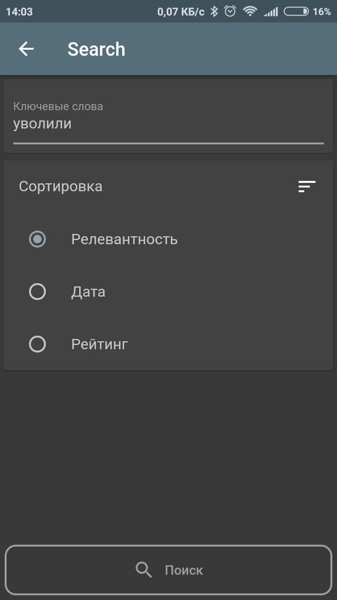
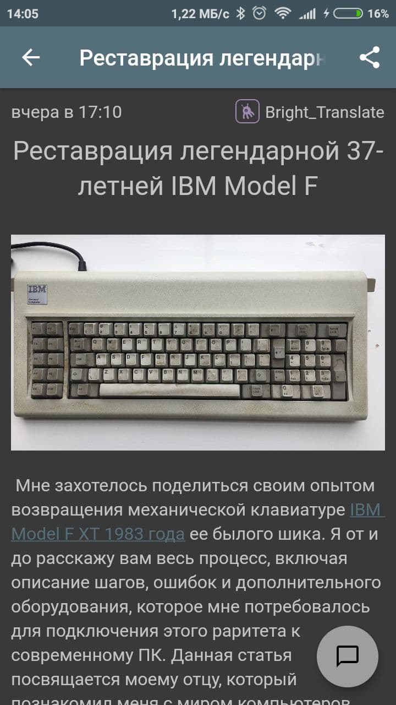
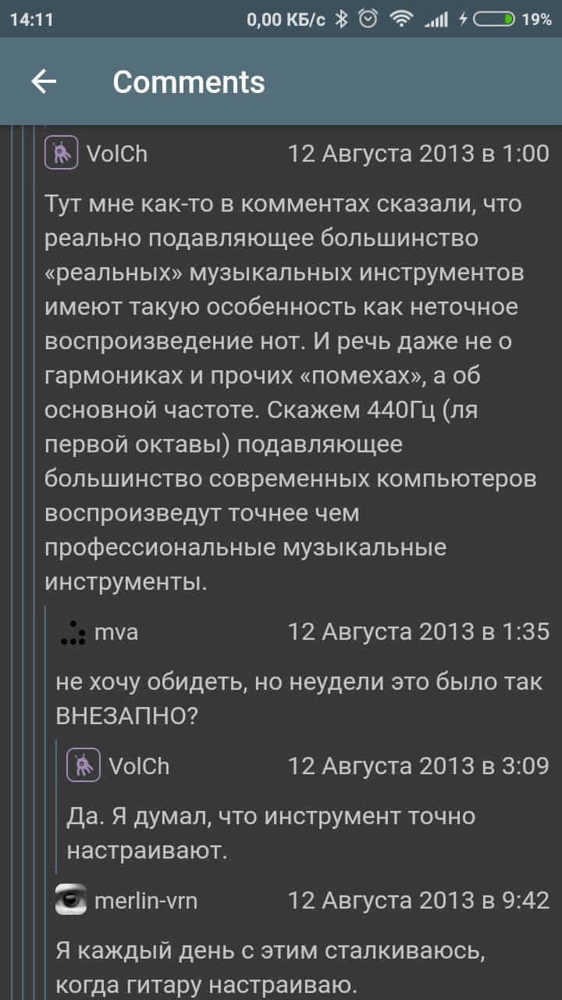

# habr app

Habr application.

Main features:
* Cache articles
* Filter articles
* Visual customizations

# Visual customization

* font size
* text alignment
* line spacing
* code styles
  * selection of a specific mode
  * dark mode coloring
  * light mode coloring

## Screenshots

</img>

</img>

</img>
</img>

</img>
</img>

</img>

## Build

```
flutter pub get
flutter pub run build_runner build
flutter build apk
```